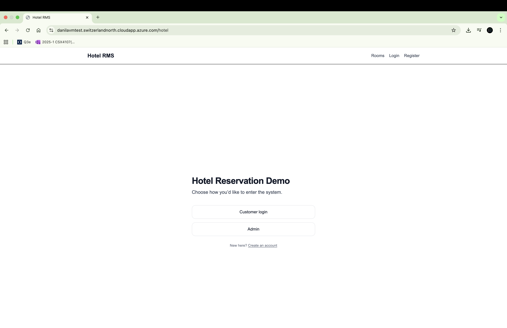
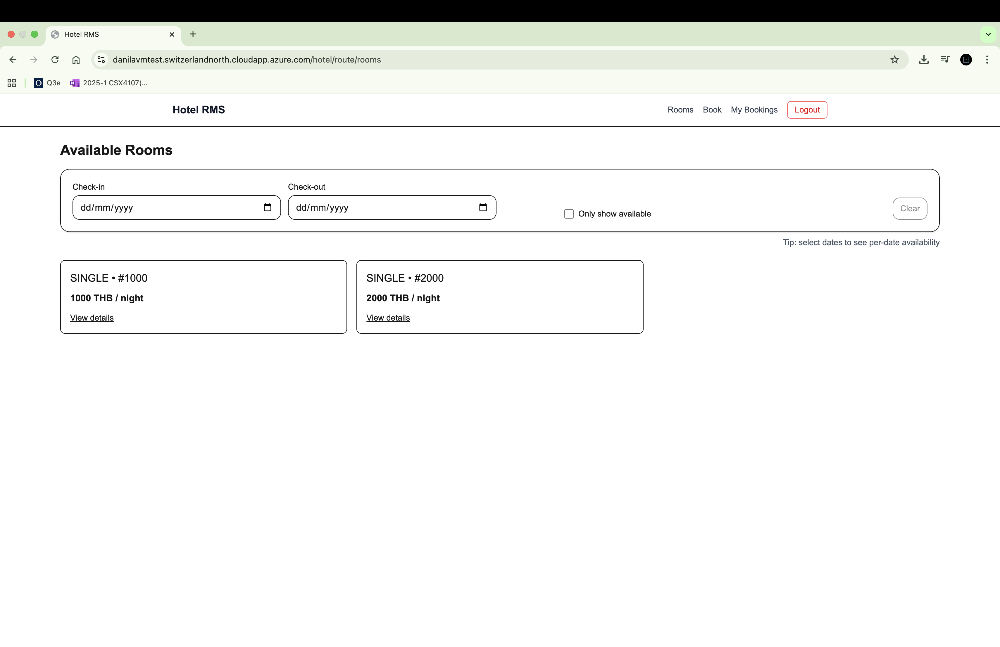
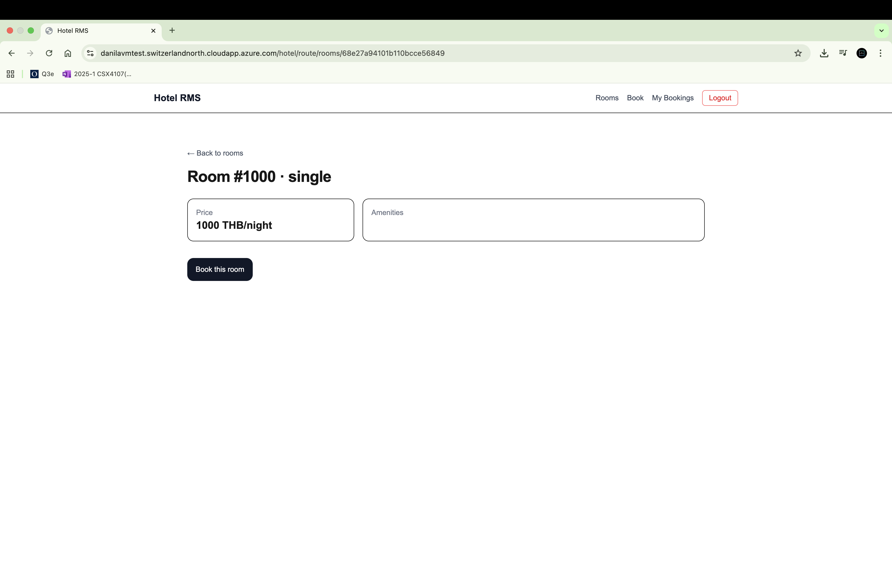
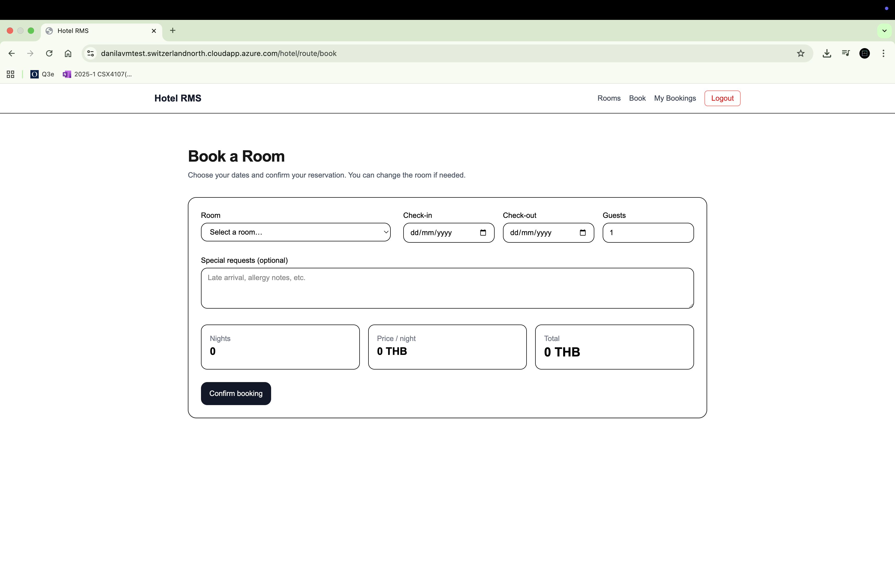
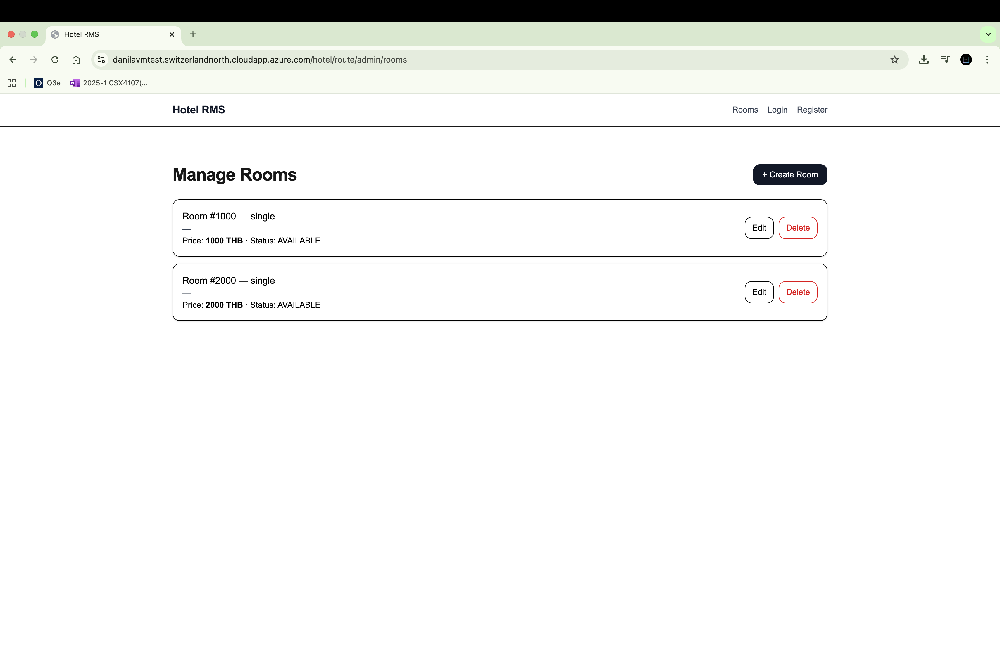
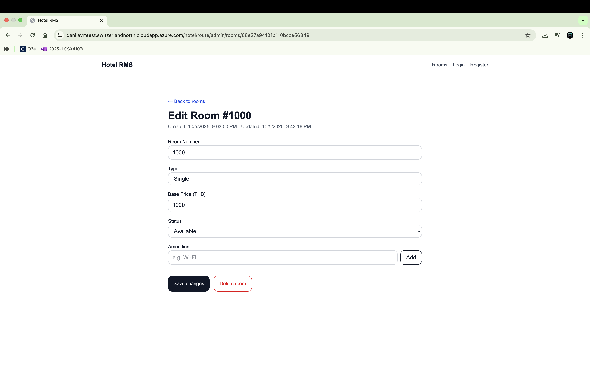
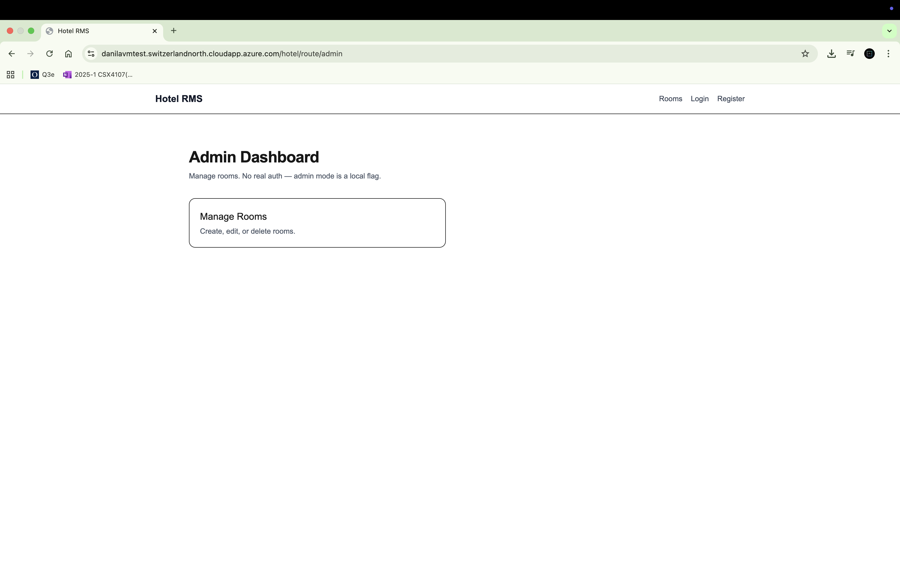
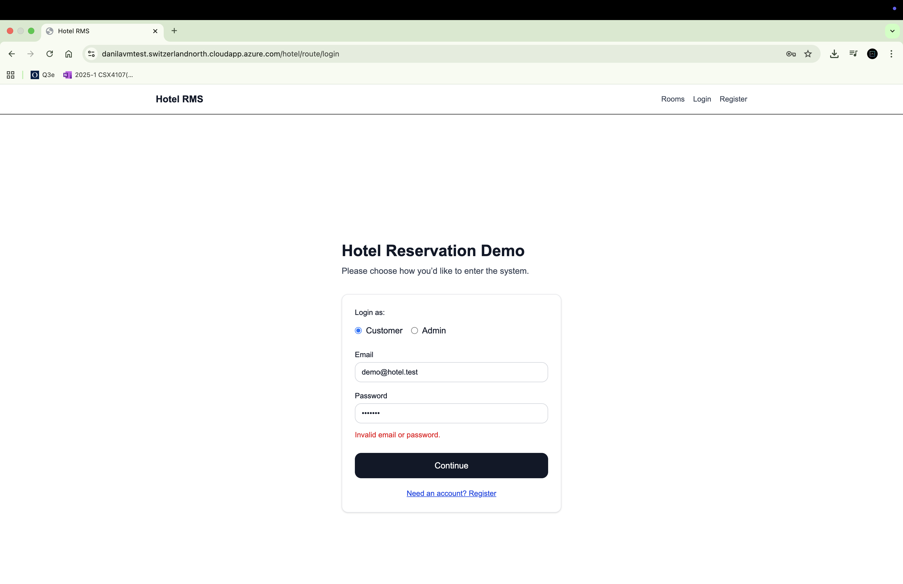
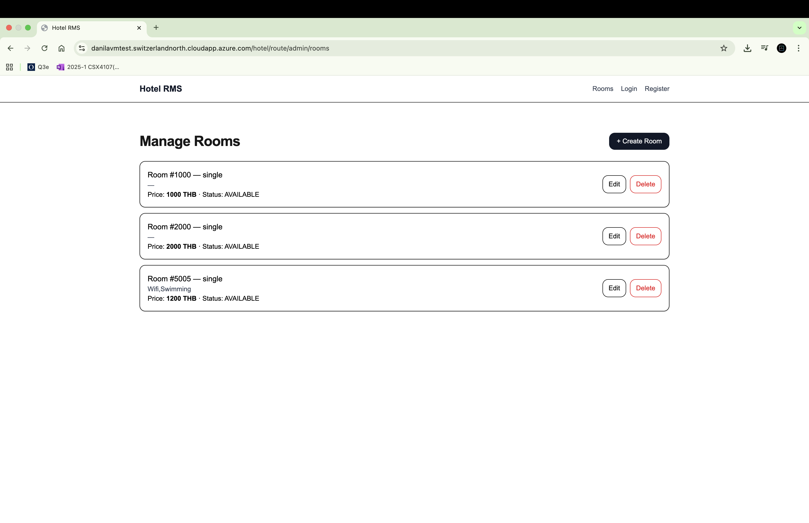

# 🏨 Hotel Reservation Management System

### 👩‍💻 Developed by:
- **Siva Paoren** — 6630064
- **Kaung Htet Oo** — 6511753
- **Danila Sergeevich Derll** — 6530154

---

## 🧾 Project Overview

A **full-stack hotel management web application** that enables customers to browse, book, and manage hotel rooms — while providing admins with tools to manage rooms, bookings, and customer data.

The system is divided into two main parts:
- **Backend:** TypeScript-based Express server (Node.js)
- **Frontend:** Next.js 15 (React 19 + TypeScript)
- **Database:** MongoDB Atlas (cloud-hosted)

---

## 🧠 Architecture Summary

### 🧩 Stack

| Layer | Technologies |
|--------|---------------|
| **Frontend** | Next.js 15 (React 19, TypeScript, TailwindCSS) |
| **Backend** | Node.js (Express + TypeScript + Mongoose) |
| **Database** | MongoDB (Cloud Atlas or local) |
| **Build Tools** | PNPM, TSUP, TSX |
| **Security & Middleware** | Helmet, CORS, Rate Limiting, Compression, Dotenv |
| **Logging** | Pino + Pino-Pretty |

---

## 🏗️ Backend Structure (`/backend`)

| File / Folder | Description |
|----------------|--------------|
| **src/app.ts** | Initializes Express app and applies middleware (CORS, helmet, compression, etc.). |
| **src/db.ts** | Handles MongoDB connection via Mongoose. |
| **src/config/env.ts** | Environment validation using zod. |
| **src/routes/** | API route modules: <br>• `bookingRoutes.ts` – CRUD for bookings.<br>• `customerRoutes.ts` – CRUD for customers.<br>• `roomRoutes.ts` – CRUD for rooms.<br>• `index.ts` – Combines and exports all routes. |
| **src/models/** | Mongoose schemas for: `Room.ts`, `Booking.ts`, `Customer.ts` |
| **src/middleware/error.ts** | Global error handler. |
| **src/server.ts** | Entry point to start Express server. |
| **/dist** | Transpiled JavaScript output. |

---

## 🎨 Frontend Structure (`/frontend`)

| Path | Description |
|-------|--------------|
| **Next.js App Router (TypeScript)** | Organized under `/src/app`. |
| `/rooms` | Browse and view room details. |
| `/book` | Booking form. |
| `/login` & `/register` | Simple auth pages for customers. |
| `/account/bookings` | Customer’s booking history. |
| `/admin/rooms` | Admin dashboard (create/edit/delete rooms). |
| **`src/api/`** | Axios API wrappers (`rooms.ts`, `bookings.ts`, `customers.ts`). |
| **`src/features/`** | Reusable UI components (e.g., `RoomCard`, `BookingForm`). |
| **`src/lib/`** | Session helpers, date utilities, type definitions. |
| **`src/ui/Navbar.tsx`** | Shared navigation bar. |
| **Styling** | TailwindCSS + PostCSS (`postcss.config.mjs`). |

---

## ⚙️ Root-Level Setup

- Unified dependencies via root `package.json` and lockfiles.
- Shared Mongoose typings ensure type safety across backend & frontend.
- PNPM workspaces implied (multi-project layout).

---

## 🚀 Typical Flow

1. **Frontend** (Next.js) makes API calls via Axios to the backend (`/api/rooms`, `/api/bookings`, etc.).
2. **Backend** validates and processes requests using Express + Mongoose.
3. **Database** (MongoDB Atlas) persists room, booking, and user data.
4. **Customer** can register, log in, browse rooms, and make bookings.
5. **Admin** can log in to manage rooms, bookings, and customer data.

---

## 🔒 Security & Middleware

- **Helmet** → Secures HTTP headers
- **CORS** → Restricts API access to frontend origin
- **Compression** → Improves response performance
- **Rate Limiting** → Prevents abuse
- **Dotenv** → Manages environment variables securely

---

## 📊 Logging

- **Pino** (lightweight JSON logger)
- **Pino-Pretty** (formatted console output)
- Automatically logs requests, errors, and MongoDB connection status.

---


## 💾 Database Configuration

MongoDB connection via `.env`:

```env
MONGODB_URI=mongodb+srv://<username>:<password>@cluster0.mongodb.net/hotel_db?retryWrites=true&w=majority
PORT=3002
NODE_ENV=production
CORS_ORIGIN=https://yourdomain/hotel

```
#Demo App Screen Shots










MIT License

Copyright (c) 2025
Permission is hereby granted, free of charge, to any person obtaining a copy
of this software and associated documentation files (the “Software”), to deal
in the Software without restriction, including without limitation the rights
to use, copy, modify, merge, publish, distribute, sublicense, and/or sell
copies of the Software, and to permit persons to whom the Software is
furnished to do so, subject to the following conditions:

The above copyright notice and this permission notice shall be included in
all copies or substantial portions of the Software.

THE SOFTWARE IS PROVIDED “AS IS”, WITHOUT WARRANTY OF ANY KIND, EXPRESS OR
IMPLIED, INCLUDING BUT NOT LIMITED TO THE WARRANTIES OF MERCHANTABILITY,
FITNESS FOR A PARTICULAR PURPOSE AND NONINFRINGEMENT.


